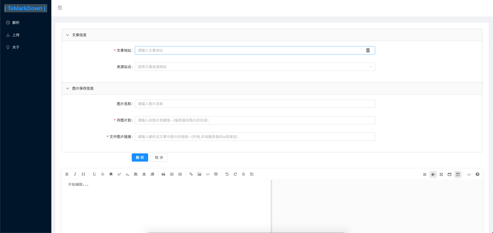
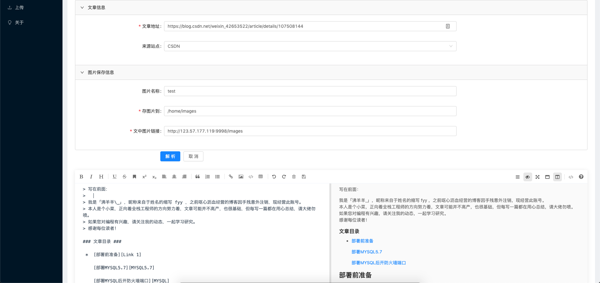
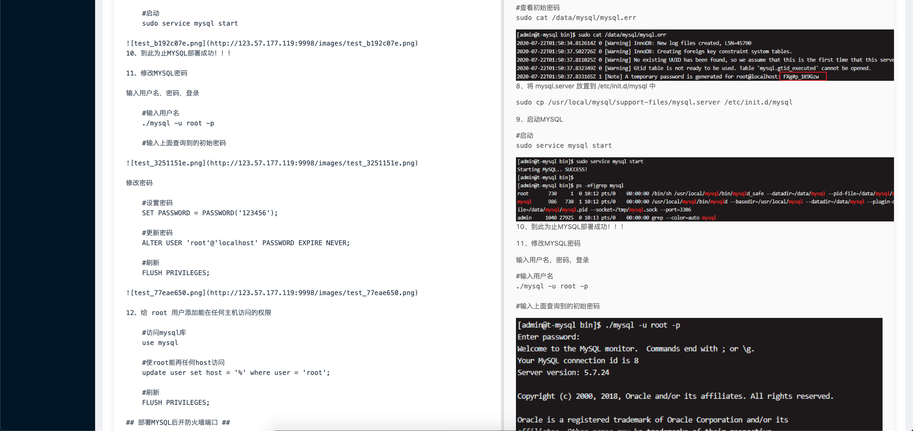
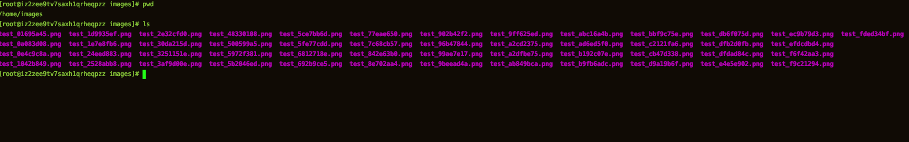

#### ToMarkdown

>描述: 将HTTP页面 解析为 Markdown 
>
>目前支持: 知乎,简书,知否(SegmentFault),掘金,CSDN博客,微信公众号文章 一键转Markdown


演示地址:   http://123.57.177.119:9999/


后端技术栈:
1. springboot v2.1.4.RELEASE
2. Jsoup解析

前端:
1. axios  请求组件
2. mavoneditor   markdown显示编辑组件
3. ant-design-vue  

界面截图






`http://123.57.177.119:9998/images `

`使用Nginx映射了/home/images图片保存图片文件夹`
 

 >Nginx的配置文件:

 ```
server
{
    listen 9998;
    server_name 124.70.218.193;
    
    location /images {
            alias /home/images;
            proxy_temp_path     /home/images;  
            expires -1; 
        }

    access_log logs/imageProxyLog.log;

}

 ```