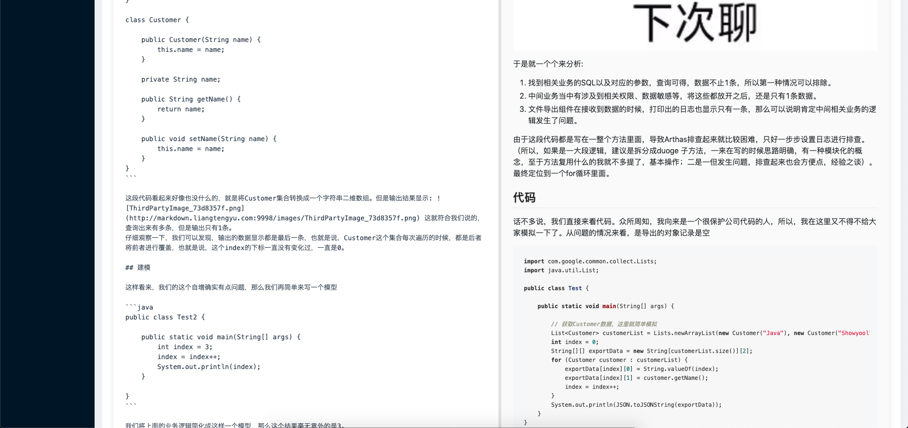

  ToMarkdown

>⚡️功能描述: 将HTTP页面 解析为Markdown格式
>目前支持: 知乎,简书,知否(SegmentFault),掘金,CSDN博客,微信公众号,V2EX 
---

  简介

>看到喜欢的文章想通过Markdown的格式保存.可以通过本项目一键解析保存图片和文档

体验地址:   http://markdown.liangtengyu.com:9999

> 公众号  &  微信

---

开始

[开始使用](./readme_images/start.md)

---
后端技术栈:
1. springboot 
2. Jsoup 
3. Remark 

---
前端:
项目目录:vue_project

1. axios  请求组件
2. mavoneditor   markdown显示编辑组件
3. ant-design-vue  

---

界面截图

 新增特性:
 - 配置通过application.yml保存文件到目录👍 
 - 图片本地保存🐶
 - 图片本地代理服务🐼
