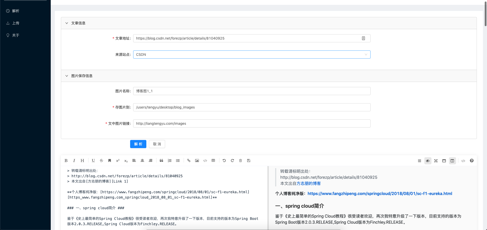

#### ToMarkDown
将HTTP页面 解析为 MarkDown

演示地址:   http://123.57.177.119:9999/

后端技术栈:
1. springboot v2.1.4.RELEASE
2. Jsoup解析

前端:
1. axios  请求组件
2. mavoneditor   markdown显示编辑组件
3. ant-design-vue  

界面截图

`ps: http://123.57.177.119:9998/images 链接使用Nginx映射了/home/images图片保存图片文件夹`

