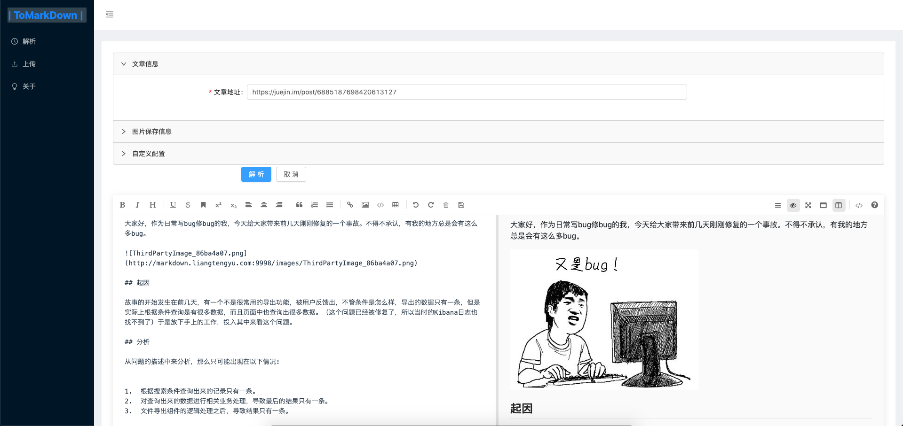
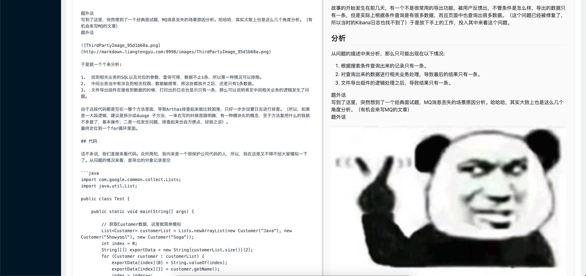
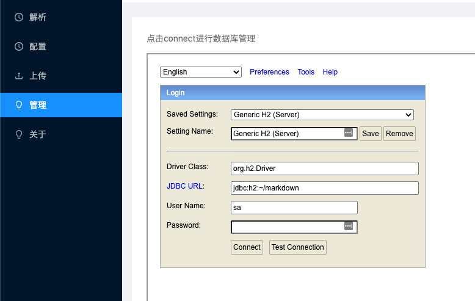
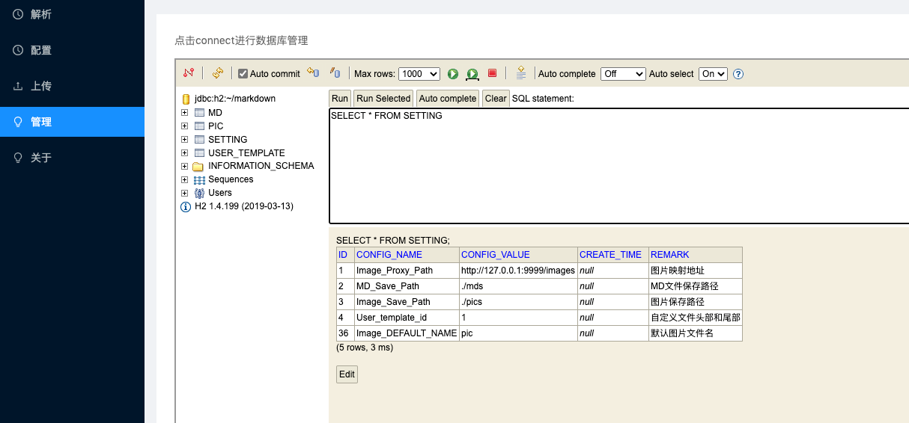
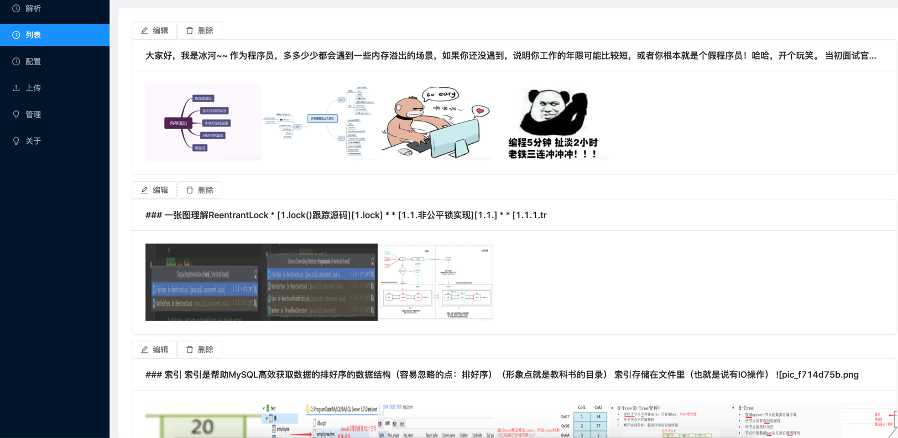

<h1 align="center"><a href="http://124.70.33.149" target="_blank">ToMarkdown</a></h1>

>⚡️功能描述: 将HTTP页面 解析为Markdown文件格式 保存以及管理
>
>目前支持: 微信公众号,知乎,知乎专栏,简书,知否(SegmentFault),掘金,CSDN,V2EX,博客园，语雀

[>>> 快速开始](./readme_images/start.md)

[>>> 在线体验](http://124.70.33.149:9999)

---

  简介

>看到喜欢的文章想通过Markdown的格式保存.可以通过本项目一键解析保存图片和文档

---

开始

[开始使用](./readme_images/start.md)

---
后端技术栈:
1. springboot
2. Jsoup
3. Remark

---
前端:
项目目录:vue_project

1. axios  请求组件
2. mavoneditor   markdown显示编辑组件
3. ant-design-vue

---

界面截图

---

保存文件以及映射 配置

---
在线数据库管理

---
文章列表管理

---

> [公众号](/vue_project/src/assets/1614755729311.jpg)

---

2023/11/10

- 新增加语雀解析
- docker镜像更新

---
2023/06/30

- 更新在线服务器地址
- 切换至新服务器

---
2022/04/06
- 修复知乎专栏
- 修复读取不全

---
2021/05/27 新增特性:
- 文章管理列表 分页
- 删除 / 更新  本地文件/本地图片
- 在线编辑文档保存功能
- 回显解析的博客URL
- 修复一些小bug

---

2021/04/07 新增特性:
- 修复 CSDN图片下载返回code:302
- 修复 知否图片下载返回code:302
- 启用线程池,多线程协同下载图片,速度更快
- 修复一些小bug

---

2021/03/05 新增特性:
- h2database管理配置
- 页面更新配置表单
- 图片代理地址动态更新
- md文件保存到数据库中

PS:更改配置后需要重启服务器加载配置

---

2020/12/28 新增特性:
- 配置通过application.yml保存文件到目录👍
- 图片本地保存🐶
- 图片本地代理服务🐼

---